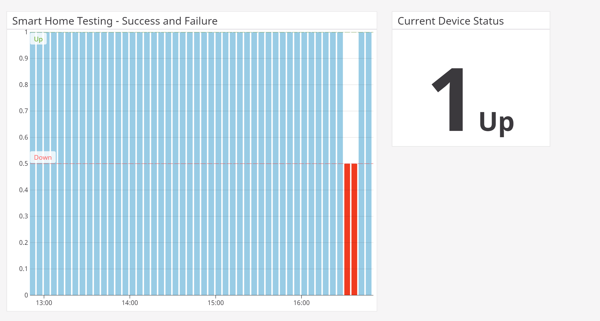

  

  <b>Smart Home Skill Testing - Sample and Guide</b> 
  Learn how to quickly and comprehensively automate testing for Smart Home skills.

    
    
    

---
# What Is This?
This is a simple project that demonstrates automated testing for a Smart Home skill.

Use this as a template for setting up automated testing for your own Smart Home skill.

# How Does It Work?
It uses Bespoken's [Virtual Device API](https://read.bespoken.io/end-to-end/api) to interact with Smart Home devices via Alexa programmatically. The test is run on a regular interval, optionally reporting results to DataDog for more advanced reporting and notifications.

This example also demonstrates an external API being used - when working with Smart Home devices, it is a best practice to use a "source of truth" to ensure that what Alexa says happened **actually** did happen. Most Smart Home devices come with their own dedicated API, and we show you how to use one as part of a complete test. 

For the purpose of this sample, we just use a mock of an external API. For a real test, an implementer should replace the mock with their real API calls.

# Test Overview
There are two test suites - [single-device-test.js](single-device-test.js) and [multi-device-test.js](multi-device-test.js).

The first one shows testing a single device, the second one shows a slightly more complex test that uses a CSV file to test a number of devices.

The basic sequence is simple:
1) Initialize the device to a "clean" state - this uses our external API
2) Interact with Alexa - "alexa, turn the bedroom lamp off"
3) Check with the device via the external API to confirm the result
4) Report the results to DataDog [OPTIONAL] 

For our multi-device test, the device names being tested come from a CSV file. For those wishing to test many different devices, this example shows a simple but powerful approach to doing this. 

# Getting Setup
To get setup, you will need the following (and some of this you likely already have):
1) [Node.js installed](https://nodejs.org/en/download/)
2) Project dependencies installed:
Open a command-line window, and run `npm install` in the directory where this project is installed
3) A Bespoken Virtual Device token:
Follow these directions to get one - [Bespoken Virtual Device setup](https://read.bespoken.io/end-to-end/setup). 
4) [OPTIONAL] A DataDog account:
DataDog is a nice tool for capturing and visualizing metrics as well as configuring notifications based on these metrics.

The virtual device token as well as the Data Dog API key should go into the [.env](.env) file. If no DataDog API key is supplied, the step to report results to DataDog will be skipped.

Once configured, you can run the tests:
`npm test`

# More Information
## Continuous Integration
These tests are configured to be run on a five-minute interval via Circle CI.

The Circle CI workflow to do this is in this file: [./.circleci/config.yml](.circleci/config.yml).

For more detailed information, the Circle CI docs are [here](https://circleci.com/docs/).

If you setup your own automated test using Circle CI, be sure to set the environment variables within Circle.

## Deako Case Study
To read more about this project, check out our Deako case study this was based on LINK HERE.

## DataDog Reporting
Take a look at this nice graph from DataDog of the uptime for our device being tested:

# Get In Touch
Interested in automated testing for Home Automation? Have questions for us?

Reach out to [support@bespoken.io](mailto:support@bespoken.io) or chat with us on [Gitter][https://gitter.im/bespoken/bst].

# TODO
- [X] Add Circle CI configuration
- [X] Add badges
- [X] Add contact info to README
- [X] Replace .env values with stubs
- [X] Add circle configuration stuff to README - tell people about setting env variables
- [X] Add lint to package.json
- [ ] Add a pretty dashboard on DataDog
- [ ] Add link to blog in README
- [ ] Add CI triggered build?
- [ ] Add Logo to README
